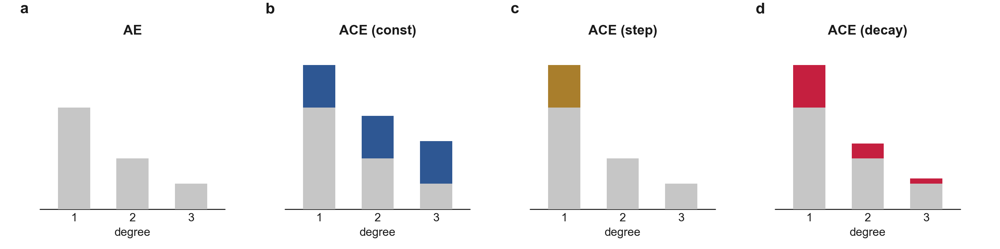

# BIGFAM



BIGFAM estimates genetic (`V_G`) and shared-environmental (`V_S`) variance
from relatives' phenotypes and family structure alone — no genotype data.
Where most methods fix how shared environment decays with relatedness (none,
constant, or a step), BIGFAM estimates that decay rate (`w_S`) from the data.

## Install

```bash
python3 -m venv .venv && .venv/bin/pip install -e .
```

## Run it

```bash
.venv/bin/python examples/quickstart.py        # simulates its own data
```

Or on the example dataset in `examples/toy_data/`, simulated at
`V_G = 0.5, V_S = 0.2, w_S = 0.2`:

```bash
.venv/bin/python scripts/run_pipeline.py examples/toy_data height continuous --cov-cols age sex
```

```text
covariates: age, sex
rho_hat   = [0.44750058 0.17570969 0.08158463]
w_s_cal   = 0.2391  w-CI=[0.010, 0.440]
V_G=0.5460 (z 8.02)  V_S=0.1742 (z 4.66)
```

`disease binary` in place of `height continuous` runs the binary path.

## Use it in Python

```python
import bigfam
from bigfam.io import load_artifacts

calib  = load_artifacts()          # the packaged Phase 2 calibration
rho    = bigfam.estimate_rho(pairs, cov, pheno, "continuous", ["age", "sex"])
ws     = bigfam.estimate_ws(rho, calib)
result = bigfam.decompose(rho, ws)

print(result.V_G, result.se_VG_cond)
print(result.w_s_cal, (result.wci_lo, result.wci_hi))
```

`pairs`, `cov` and `pheno` are three DataFrames — their shape is in
[docs/01-usage.md](docs/01-usage.md), and what comes back is in
[docs/02-results.md](docs/02-results.md).

## Repository map

| Path | Contents |
|---|---|
| `bigfam/` | the package — `phase1/`, `phase2/`, `phase3/`, plus shared `core/` and `io/` |
| `bigfam/artifacts/ws_calibration.json` | trained Phase 2 coefficients, the only file inference reads; rebuild with `scripts/train_phase2.py` |
| `examples/` | `quickstart.py`, the toy dataset and its generator |
| `analysis/` | one folder per paper figure, each self-contained — see [analysis/README.md](analysis/README.md) |
| `scripts/` | `run_pipeline.py` (estimate), `train_phase2.py` (retrain) |
| `tests/` | `pip install -e ".[dev]"`, then `pytest tests/` |

## Documentation

| Doc | Covers |
|---|---|
| [docs/01-usage.md](docs/01-usage.md) | Run it, and the shape of the input |
| [docs/02-results.md](docs/02-results.md) | What the output means |
| [docs/03-api.md](docs/03-api.md) | Reference and recipes |

Derivations are in the papers below, not in this repository.

## References

- Lee, J.J., Han, B. BIGFAM — variance components analysis from relatives
  without genotype. *Nature Communications* **16**, 5476 (2025).
  https://doi.org/10.1038/s41467-025-60502-0
- Lee, J.J., Han, B. BIGFAM — Estimating common-environmental decay reveals instability in family-based
  heritability estimates. *Under review*.

## License

Non-commercial academic research use — see `LICENSE`.
